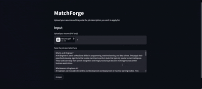

# Job Application Agent

## Overview
I think I don't only speak for myself when I say that I come across a job description but I am not sure whether my resume will make it through. A lot of us face this and aren't sure whether to identify and learn the skill gaps mentioned in the job description or just rephrase the existing resume into a new one to fit well with the description. MatchForge is an AI-powered job application assistant that helps candidates understand how well their resume aligns with a job description before they apply. 



## How It Works
The user have to upload a resume alongside copying and pasting the text of the job description they wish to apply to. The agent calls the match_score and skills_analyzer tool to identify the skills gap and how much of the resume is already matching with the JD. After the analysis, it will require your approval to call the rewrite_resume tool for rewriting the resume without changing the factual accuracy of the original one.

## Tech Stack
- Python 

- Google Gemini 3.5 Flash 

- sentence-transformers (all-MiniLM-L6-v2) 

- Pydantic 

- Streamlit 


## Project Structure
```
job-application-agent/
├── app.py                  # Streamlit frontend
├── agent.py                # Orchestration layer which coordinates all tools in sequence
├── tools/
│   ├── pdf_parser.py       # Extracts plain text from uploaded PDF resumes
│   ├── skills_analyzer.py  # Identifies present and missing skills using Gemini
│   ├── score_calculator.py # Calculates match score using embedding similarity + LLM reasoning
│   ├── resume_rewriter.py  # Rewrites resume to better align with job description
│   └── utils.py            # Shared retry utility with exponential backoff
├── memory/
│   └── state.py            # AgentState dataclass — shared state across all tools
├── prompts/
│   └── templates.py        # Centralized LLM prompt templates
└── requirements.txt        # Project dependencies
```

## How to Run
You can access the live demo link here: [MatchForge](https://job-application-agent-ohjibnu9bfw6ehmjprsjno.streamlit.app/)

If you want to run this project locally on your device, then execute the following steps:
1. Clone this repository: `https://github.com/Manjit345/job-application-agent.git`
2. Create a virtual environment and activate it: `python -m venv <your_environment_name_here>` `<your_environment_name_here>/Scripts/activate`
3. Install dependencies: `pip install -r requirements.txt`
4. Create a `.env` file with your Gemini API key: `GEMINI_API_KEY=<your_key_here>`
5. Run the app: `streamlit run app.py`

## Notes

### Match Score
Please do not confuse the match score with an ATS score of a resume. Different companies may have different ATS evaluation criterias and no single software can guarantee covering all the scenarios. What the match score feature in this project does is that, it performs an embedding similarity on the uploaded resume to see how much is it in alignment with the specified job description.

### Rate Limiting
This app runs on Gemini's free tier which has a daily request limit. A soft session limit of 3 analyses is applied per browser session as a UX nudge but it can be bypassed by refreshing the page since no server-side tracking is implemented. If the daily quota is exhausted, the app will display an error message. Please be mindful of this when using the demo.

### Reference
There is a resource which I referred to while building this project and it deserves a mention. You can go through it here: [The Building Blocks of an Agent from Dave Ebbelaar's AI Cookbook](https://github.com/daveebbelaar/ai-cookbook/tree/main/agents/building-blocks)

## Future Improvements
- IP-based rate limiting for production deployment
- Persistent storage for saving analysis history across sessions
- Support for DOCX resume uploads in addition to PDF

## License
This project is open-source and available under the MIT License.

## Contact
For issues or questions, please open a GitHub issue.